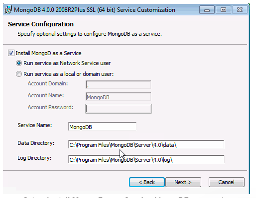
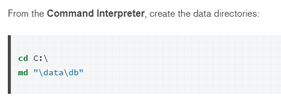
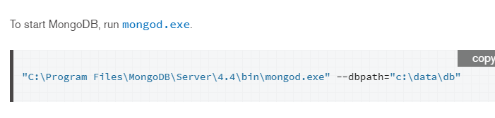
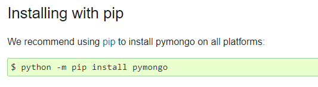

# Projet movies- SpinOFF 3 - Client Floupics

Notre nouvelle collaboration nous emmene plus loin. Cette fois vous souhaitez utiliser MongoDB afin de pouvoir lire nos données movie dans un format orientées document.

La prestation comprend:

1. L'instalation et la mise en place de MongoDB Community Edition en local de MongoDB

2. la création d'une collection Movies et de documents à partir du CSV Movies small avec Python3 et sa visualisation sur MongoDB Compass

MongoDB est un système de gestion de base de données orienté documents. Il est écrit en C++. Le serveur et les outils sont distribués sous licence SSPL, les pilotes sous licence Apache et la documentation sous licence Creative Commons5. Il fait partie du NoSQL (notOnly SQL).

MongoDB permet de manipuler des objets structurés au format BSON (JSON binaire), sans schéma prédéterminé. En d'autres termes, des clés peuvent être ajoutées à tout moment, sans reconfiguration de la base.

Les documents seront disponibles sur Github à cette adresse:

Nous disposons de la movies.csv dans le dossier "movies csv"
du fichier movies.json dans le dossier "movies_json"
et du dossier image contenant nos fichier Images. 

1. Lors de l'installation vous pouvez configurer et démarrer MongoDB en tant que service Windows pendant l’installation, et le service MongoDB se lance dès lors que l'installation est réussie. 

Si on choisi de ne pas installer MongoDB comme service Windows, il faut alors passer par un terminal en tant qu'administrateur et effectuer les lignes suivantes pour pouvoir lancer MongoDB et créer un répertoire de base de données:

Il faut aussi installer PyMongo qui est un paquet Python.  PyMongo est le pilote officiel Python pour MongoDB.

2. Pour la deuxième phase, le rendu final pourra être visualisé sur le document Jupyterlab notebook "Scipt.ipynb".

Lien Utile pour réalisation du projet :

Pour l'installation de MongoDB : voici le lien pour le télécharger https://www.mongodb.com/try/download/community?tck=docs_server
et les liens pour les documents d'aides selon votre système d'exploitation https://docs.mongodb.com/manual/installation/#mongodb-community-edition-installation-tutorials